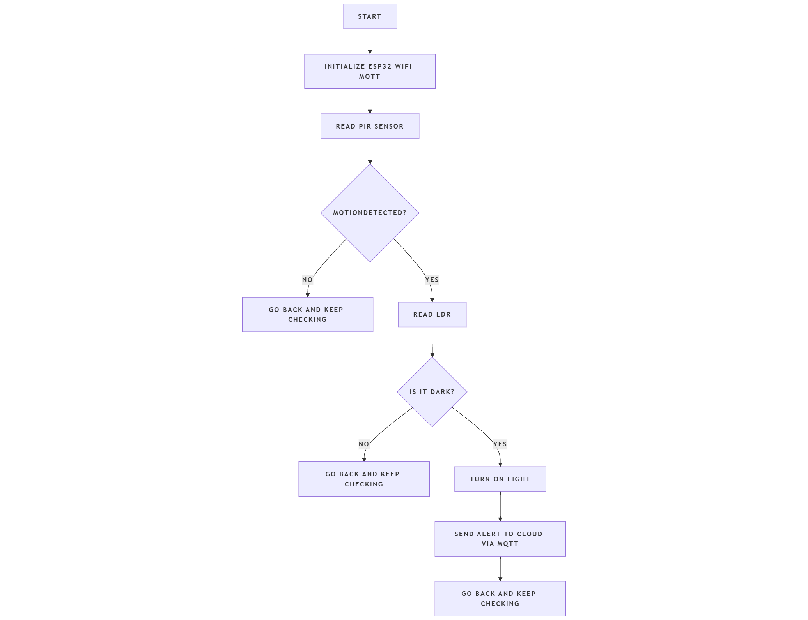

# 🏠 IoT Smart Security & Light Control System

<div align="center">


_An intelligent IoT-based security and lighting system using ESP32 and cloud connectivity_

</div>

---

## 📋 Overview

- [🎯 Aim](#-aim)
- [❗ Problem Statement](#-problem-statement)
- [🔍 Scope of the Solution](#-scope-of-the-solution)
- [📖 Project Description](#-project-description)
- [✨ Features](#-features)
- [🛠️ Required Components](#-required-components)
- [📚 Libraries Used](#-libraries-used)
- [📊 Flowchart](#-flowchart)
- [🔌 Simulated Circuit](#-simulated-circuit)
- [🚀 Usage Guide](#-usage-guide)
- [📁 Project Structure](#-project-structure)
- [📡 MQTT Configuration](#-mqtt-configuration)
- [🌐 Wokwi Development](#-wokwi-development)
- [📄 License](#-license)

---

## 🎯 Aim

To develop an intelligent IoT-based Smart Security and Light Control System that provides automated home security monitoring with intelligent lighting management through cloud connectivity, enabling remote monitoring and real-time alerts for enhanced home automation and security.

---

## ❗ Problem Statement

Traditional home security systems face several limitations:

- **🔒 Limited Connectivity**: Most security systems operate independently without internet connectivity
- **💡 Manual Light Control**: Conventional lighting systems require manual operation and lack automation
- **📱 No Remote Monitoring**: Inability to monitor home security status remotely
- **⚡ High Energy Consumption**: Lights remain on unnecessarily, leading to energy wastage
- **🔔 Delayed Alerts**: Security breaches are detected only when physically present
- **💰 High Cost**: Commercial security systems are expensive and require professional installation

---

## 🔍 Scope of the Solution

Our IoT Smart Security & Light Control System addresses these challenges by providing:

### 🛡️ **Security Enhancement**

- Real-time motion detection using PIR sensors
- Instant cloud-based alert notifications
- Remote monitoring capabilities through web dashboard
- Historical data logging for security analysis

### 💡 **Intelligent Lighting**

- Automatic light control based on ambient conditions
- Motion-triggered lighting activation
- Energy-efficient operation with smart scheduling
- Remote lighting control via cloud platform

### 🌐 **Cloud Integration**

- MQTT protocol for reliable data transmission
- Adafruit IO platform for data visualization
- Real-time status updates and remote control
- Mobile and web accessibility

### 🎯 **Target Applications**

- Residential home security
- Small office monitoring
- Educational IoT projects
- Smart home automation systems

---

## 📖 Project Description

This IoT Smart Security & Light Control System is an intelligent home automation solution that combines security monitoring with automated lighting control. The system uses ESP32 microcontroller with WiFi connectivity to provide real-time monitoring and control through cloud-based MQTT communication via Adafruit IO platform.

### 🎯 Key Objectives

- **🔐 Smart Security**: PIR motion sensor-based intrusion detection system
- **💡 Intelligent Lighting**: Automated light control based on ambient conditions and motion
- **📱 Remote Monitoring**: Cloud-based monitoring and control through Adafruit IO
- **⚡ Real-time Alerts**: Instant notifications for security events

---

## ✨ Features

- **🚨 Motion Detection**: PIR sensor-based human presence detection
- **🌞 Light Sensing**: Automatic light control based on ambient conditions
- **☁️ Cloud Connectivity**: Real-time data transmission via MQTT
- **📊 Dashboard Monitoring**: Live status updates on Adafruit IO
- **🔔 Instant Alerts**: Immediate security notifications
- **💡 Smart Lighting**: Energy-efficient automated lighting system
- **📱 Remote Control**: Monitor and control from anywhere with internet
- **🔋 Low Power**: Optimized for energy efficiency

---

## 🛠️ Required Components

### 🔧 **Hardware Components**

| Component                      | Quantity | Specifications                     | Purpose                                |
| ------------------------------ | -------- | ---------------------------------- | -------------------------------------- |
| ESP32 Development Board        | 1        | WiFi + Bluetooth, 32-bit dual-core | Main microcontroller with connectivity |
| PIR Motion Sensor (HC-SR501)   | 1        | Detection range: 3-7m, Angle: 120° | Human movement detection               |
| LDR (Light Dependent Resistor) | 1        | 5-200kΩ resistance range           | Ambient light sensing                  |
| LED (Red)                      | 1        | 5mm, 20mA forward current          | Security alert indicator               |
| LED (White/Yellow)             | 1        | 5mm, 20mA forward current          | Automatic lighting control             |
| Resistors                      | 2        | 220Ω (2x)                          | Current limiting and pull-up           |
| Breadboard                     | 1        | Mini Breadboard                    | Circuit prototyping                    |
| Jumper Wires                   | 15-20    | Male-to-male                       | Component connections                  |

### 💻 **Software Requirements**

| Software                 | Version                 | Purpose                                        |
| ------------------------ | ----------------------- | ---------------------------------------------- |
| **Wokwi Editor**         | Latest                  | Online circuit simulation and code development |
| **Web Browser**          | Modern (Chrome/Firefox) | Accessing Wokwi platform and Adafruit IO       |
| **Adafruit IO Platform** | Cloud Service           | MQTT broker and data visualization             |
| **WiFi Network**         | 2.4GHz supported        | Internet connectivity for ESP32                |

### ☁️ **Cloud Environment**

| Service           | Provider            | Purpose                            | Cost                       |
| ----------------- | ------------------- | ---------------------------------- | -------------------------- |
| **Adafruit IO**   | Adafruit Industries | MQTT broker, data feeds, dashboard | Free tier available        |
| **WiFi Internet** | Local ISP           | Network connectivity               | User's existing connection |
| **Web Dashboard** | Adafruit IO         | Remote monitoring interface        | Included in service        |

---

## 📚 Libraries Used

- **WiFi.h**: ESP32 WiFi connectivity
- **Adafruit_MQTT.h**: MQTT protocol implementation
- **Adafruit_MQTT_Client.h**: MQTT client for Adafruit IO

---

## 📊 Flowchart



### 🔄 **Process Flow Description**

1. **🔌 System Initialization**: ESP32 boots up and initializes all components
2. **📶 WiFi Connection**: Establishes connection to local WiFi network
3. **☁️ Cloud Connection**: Connects to Adafruit IO MQTT broker
4. **📊 Sensor Reading**: Continuously monitors PIR and LDR sensors
5. **🚨 Alert Generation**: Triggers security alerts on motion detection
6. **💡 Light Control**: Automatically controls lighting based on ambient conditions
7. **📤 Data Transmission**: Sends sensor data and status to cloud platform
8. **📊 Dashboard Update**: Real-time updates on Adafruit IO dashboard

---

## 🔌 Simulated Circuit


_Complete circuit diagram from Wokwi simulation - Image to be added_

### ⚙️ **Circuit Features**

- 🔌 **Power Supply**: 3.3V from ESP32 for all components
- 🛡️ **Protection**: Current limiting resistors for LEDs
- 📡 **Communication**: Digital and analog GPIO pins
- 🔧 **Expandable**: Additional GPIO pins available for future enhancements

---

## 🚀 Usage Guide

Follow these step-by-step instructions to get your IoT Smart Security & Light Control System up and running:

### 📋 **Prerequisites**

Before starting, make sure you have:

- A modern web browser (Chrome, Firefox, Safari, or Edge)
- Stable internet connection
- Valid email address for account creation

---

### 🌐 **Step 1: Access the Wokwi Project**

1. **Open the Project**: Click on the link below to access the pre-configured Wokwi simulation:

   [](https://wokwi.com/projects/434034620905714689)

2. **Explore the Circuit**: Take a moment to familiarize yourself with the circuit layout and components

---

### 🔧 **Step 2: Set Up Adafruit IO Account**

#### **Create Your Account**

1. **Visit Adafruit IO**: Go to [io.adafruit.com](https://io.adafruit.com)
2. **Sign Up**: Click "Get Started for Free" and create your account
3. **Verify Email**: Check your email and verify your account
4. **Login**: Sign in to your new Adafruit IO account

#### **Get Your Credentials**

1. **Navigate to Settings**: Click on your username → "My Key"
2. **Copy Credentials**: You'll need:
   - **AIO Username**: Your Adafruit IO username
   - **AIO Key**: Your unique Active Key (keep this secret!)

---

### 📡 **Step 3: Create Data Feeds**

Create the following feeds in your Adafruit IO dashboard:

#### **Required Feeds Setup**

1. **Go to Feeds**: Click "Feeds" in the top navigation
2. **Create New Feed**: Click "New Feed" button
3. **Create these feeds one by one**:

| Feed Name         | Feed Key          | Description                        |
| ----------------- | ----------------- | ---------------------------------- |
| `motion-detected` | `motion-detected` | PIR sensor motion detection status |
| `light-level`     | `light-level`     | LDR ambient light readings         |
| `security-alert`  | `security-alert`  | Security system alert status       |
| `auto-light`      | `auto-light`      | Automatic light control status     |

#### **Feed Creation Steps**:

- **Name**: Enter the feed name
- **Description**: Add a brief description
- **Privacy**: Keep as "Public" or "Private" (your choice)
- Click **"Create"**

---

### ⚙️ **Step 4: Configure the Code**

#### **Update Adafruit IO Credentials**

1. **Return to Wokwi Project**: Go back to the [Wokwi project](https://wokwi.com/projects/434034620905714689)
2. **Open Code Editor**: Click on the `sketch.ino` file
3. **Find Configuration Section**: Look for these lines near the top:

```cpp
#define AIO_USERNAME    "YOUR_AIO_USERNAME"
#define AIO_KEY         "YOUR_AIO_KEY"
```

4. **Replace Credentials**:
   - Replace `YOUR_AIO_USERNAME` with your actual Adafruit IO username
   - Replace `YOUR_AIO_KEY` with your actual AIO key from Step 2

#### **Update WiFi Settings** (Optional for Simulation)

For simulation purposes, the default WiFi settings work fine:

```cpp
#define WLAN_SSID       "Wokwi-GUEST"
#define WLAN_PASS       ""
```

---

### ✅ **Step 5: Run the Simulation**

#### **Start Simulation**

1. **Click Start**: Press the green "Start Simulation" button in Wokwi
2. **Monitor Serial Output**: Watch the serial monitor for connection status
3. **Check Connections**: Verify WiFi and MQTT connections are successful

#### **Expected Serial Output**

```
WiFi connected! IP: xx.xx.x.x
System Ready!
Connecting to MQTT... MQTT Connected!
📡 Publishing data...
```

---

### 🚨 **Troubleshooting**

#### **Common Issues & Solutions**

| Issue                      | Possible Cause        | Solution                             |
| -------------------------- | --------------------- | ------------------------------------ |
| **WiFi Connection Failed** | Wrong credentials     | Check WiFi SSID and password         |
| **MQTT Connection Failed** | Wrong AIO credentials | Verify AIO username and key          |
| **No Data in Dashboard**   | Feeds not created     | Create required feeds in Adafruit IO |
| **Sensors Not Working**    | Circuit connections   | Check wiring in Wokwi circuit        |
| **LEDs Not Lighting**      | Resistor values       | Verify 220Ω resistors are connected  |

#### **Debug Tips**

1. **Check Serial Monitor**: Always monitor serial output for error messages
2. **Verify Feeds**: Ensure all feed names match exactly in code and Adafruit IO
3. **Test Connections**: Use simple MQTT test messages first
4. **Check Syntax**: Ensure no typos in credentials

---

## 📁 Project Structure

```
IoT-Smart-Security-System/
├── 📁 images/
│   └── 📄 circuit-diagram.png   # Circuit schematic
│   └── 📄 flowchart.png         # Flowchart of the code
├── 📁 src/
    └── 📄 main.ino             # Main Arduino sketch with all functionality
    └──📄 diagram.json               # Wokwi circuit configuration
    └──📄 libraries.txt              # Required libraries list
└── 📄 LICENSE                   # MIT License
├── 📄 README.md                 # Project documentation
```

---

## 📡 MQTT Configuration

### **Adafruit IO Settings**

```cpp
#define AIO_SERVER      "io.adafruit.com"
#define AIO_SERVERPORT  1883
#define AIO_USERNAME    "your_aio_username"
#define AIO_KEY         "your_aio_key"
```

### **Feed Configuration**

```cpp
Adafruit_MQTT_Publish motion_feed = Adafruit_MQTT_Publish(&mqtt, AIO_USERNAME "/feeds/motion-detected");
Adafruit_MQTT_Publish light_feed = Adafruit_MQTT_Publish(&mqtt, AIO_USERNAME "/feeds/light-level");
Adafruit_MQTT_Publish alert_feed = Adafruit_MQTT_Publish(&mqtt, AIO_USERNAME "/feeds/security-alert");
```

---

## 🌐 Wokwi Development

### **Simulation Features**

- **Real-time Circuit Simulation**: Test your circuit before building hardware
- **Component Library**: Extensive library of IoT components
- **Code Editor**: Integrated Arduino IDE with syntax highlighting
- **Serial Monitor**: Debug output and system monitoring
- **WiFi Simulation**: Simulated internet connectivity for cloud testing

### **Wokwi Project Link**

🔗 **Direct Access**: [https://wokwi.com/projects/434034620905714689](https://wokwi.com/projects/434034620905714689)

---

## 📄 License

This project is licensed under the **MIT License** - see the [LICENSE](LICENSE) file for details.

---
